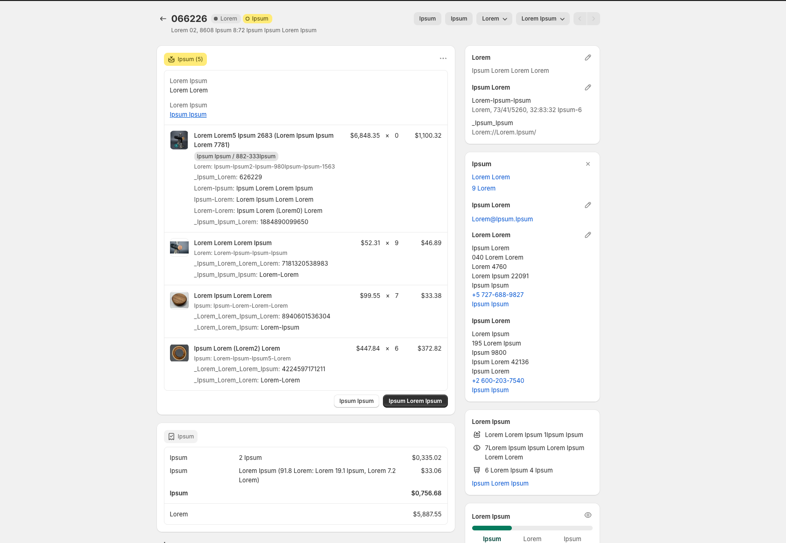
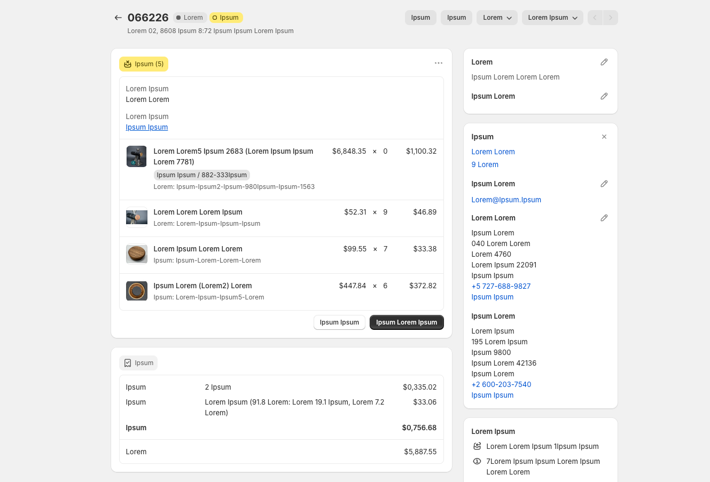

# Shopify Admin Cleaner 

A simple bookmarklet that helps clean up the Shopify admin interface by hiding redundant details. This tool helps you show/print only the information you need.

<table>
  <tr>
    <td width="45%">
      
      <em>Before: Shopify admin interface with all details visible<br>(Data anonymized using <a href="https://github.com/MrGKanev/browser-text-anonymizer">browser-text-anonymizer</a>)</em>
    </td>
    <td width="45%">
      
      <em>After: Clean interface with redundant details hidden<br>(Data anonymized using <a href="https://github.com/MrGKanev/browser-text-anonymizer">browser-text-anonymizer</a>)</em>
    </td>
  </tr>
</table>

## Features

- Hides subdued text elements in the Shopify admin interface
- One-click activation
- No installation required
- Works with all modern browsers
- Zero dependencies

## Installation

1. Visit the tool's webpage
2. Drag the green "🧹 Hide Details" button to your browser's bookmarks bar
3. Navigate to your Shopify admin orders page
4. Click the bookmark to activate the cleaner

## How It Works

The bookmarklet injects a small CSS rule that hides paragraphs containing subdued text (`.Polaris-Text--subdued`), resulting in a cleaner interface without affecting functionality.

## Plugin Compatibility

The cleaner has been tested with the following Shopify plugins:

- [Order Printer](https://apps.shopify.com/order-printer)
- [ShipStation](https://apps.shopify.com/shipstation)
- [Meteorik: Analytics & Emails](https://apps.shopify.com/metorik)
- [Globo Product Options](https://apps.shopify.com/product-options-pro)


Note: Plugin compatibility may vary with different versions. If you find a plugin that works well with the cleaner, feel free to submit a pull request to update this list.

## Useful Commands

- Continuously watch for changes in the `style.css` file, updating the output file whenever changes occur.

```bash
npx @tailwindcss/cli -i ./assets/style.css -o ./assets/style.min.css --watch
```

- Generate a minified version of the CSS

```bash
npx @tailwindcss/cli -i ./assets/style.css -o ./assets/style.min.css --minify 
```

## Contributing

We welcome contributions to improve plugin compatibility! If you'd like to add support for a new plugin:

1. Fork the repository
2. Test the cleaner with your plugin
3. Update the Plugin Compatibility section in the README
4. Submit a pull request with your changes

Please include the following information when adding a new plugin:

- Plugin name
- Tested version
- Any specific considerations or limitations

## Compatibility

- Works with all major browsers (Chrome, Firefox, Safari, Edge)
- Compatible with latest Shopify admin interface
- Tested with Shopify's Polaris design system

## Author

Created by [Gabriel Kanev](https://gkanev.com)

## License

This project is available under the MIT License. See the LICENSE file for details.

## Support

For support, please:

1. Check the troubleshooting guide
2. Search existing issues
3. Create a new issue if needed

Made with ❤️ for the Shopify community
